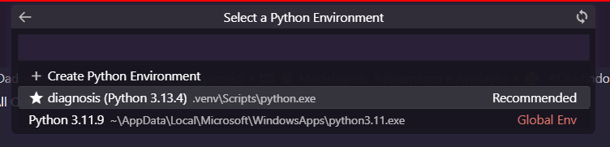

# Tech Challenge Fase 1 - Grupo 42
## Integrantes do Grupo 11
Marx Engels Antunes Correia
marx.correia@solutis.com.br
``RM: 366404``

Moacir Maciel Neto
moacir.neto@solutis.com.br
``RM: 366374``

Rogério Monteiro Magalhães
aerogerio@yahoo.com.br
``RM: 366397``

Kaliston Silvanio de Sousa
kaliston.sousa@solutis.com.br
``RM: 366377``


## Pré requisitos de execução no VSCode

### 1. Plugins do VSCode para execução de Jupiter Notebook
    Jupyter

### 2. Instalação do gerenciador de dependências UV
```
uv python install
```

### 3. Instalação das dependências
```
uv sync
```

### 4. Seleção do Kernel
Certifique-se de selecionar o Kernel diagnosis



## Detalhes para execução do script

### 1. Dataset utilizado
Para visualizar os dados utilizados, acesse o arquivo ``data/breast-cancer-wisconsin-data.csv``

### 2. Execução do script
Para executar o script de análise, acesse e execute o arquivo ``notebook/fase2/techChallengeGrupo42.ipynb``


